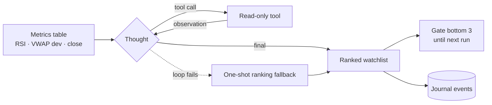

# AI Stock Portfolio Agent

An automated US equities trading agent with a real-time dashboard — paper trading on Alpaca, rule-based execution, and LLM oversight that can veto or rank trades but never initiate them.

## About

This project is a full-stack trading system built to explore algorithmic trading with a safety-first design: fast Python rules handle every 1-minute bar, while large language models only review, rank, or veto decisions. Trades execute against an Alpaca paper account, so you can run strategies on live market data without risking real capital.

The agent runs a daily pipeline — morning screener, pre-market briefing, live bar streaming, signal generation, a [ReAct watchlist ranking](#react-watchlist-ranking) that gates weak symbols, risk checks, and bracket order execution — and logs everything to SQLite. A React dashboard (served by FastAPI on port 8000) shows portfolio overview, trades, signals, screener results, events, logs, and an admin panel for runtime settings.

It supports two strategy modes configured in `config/settings.yaml`: **scalper** (intraday, ~0.20% targets during the first two hours) and **swing** (multi-day holds with 2–3% targets and overnight positions). LLM providers are pluggable: OpenRouter, Google AI Studio, local Ollama, or OpenClaw for alerts.

## Getting Started

### Prerequisites

- Python 3.11+
- Node.js 18+ (for the dashboard frontend)
- An [Alpaca](https://app.alpaca.markets/) paper trading account (API key + secret)
- At least one LLM provider (recommended: [OpenRouter](https://openrouter.ai/) API key, or local [Ollama](https://ollama.com/))
- Optional: [Finnhub](https://finnhub.io/) API key for earnings calendar in the screener

### Installation

```bash
git clone https://github.com/jagdishpatel-dev/AI_Stock_agent.git
cd AI_Stock_agent

python3 -m venv .venv
source .venv/bin/activate
pip install -r requirements.txt

cp .env.example .env
# Edit .env with your Alpaca keys and LLM provider credentials
```

Build the dashboard frontend:

```bash
cd frontend
npm install
npm run build
cd ..
```

### Environment variables

Copy `.env.example` to `.env` and configure:

| Variable | Purpose |
|----------|---------|
| `ALPACA_API_KEY` / `ALPACA_SECRET_KEY` | Alpaca paper trading credentials |
| `ALPACA_BASE_URL` | `https://paper-api.alpaca.markets` for paper trading |
| `OPENROUTER_API_KEY` | Primary LLM provider (when using OpenRouter) |
| `GOOGLE_API_KEY` | Google AI Studio (alternative LLM provider) |
| `OLLAMA_HOST` / `OLLAMA_MODEL` | Local Ollama fallback |
| `ADMIN_API_KEY` | Required for admin API writes (`/api/admin/*`) |
| `FINNHUB_API_KEY` | Optional — earnings data for the daily screener |

See `.env.example` for the full list and defaults.

## Usage

### Run the trading agent

```bash
source .venv/bin/activate
python -m src.main
```

The agent connects to Alpaca market data WebSockets, builds 1-minute bars, evaluates entry/exit signals, applies risk limits, and places bracket orders during the configured session window.

### Run the dashboard

```bash
source .venv/bin/activate
python scripts/run_dashboard.py
```

Open [http://localhost:8000](http://localhost:8000) for the React UI. The API serves both REST endpoints under `/api/*` and the built frontend from `frontend/dist/`.

For local frontend development with hot reload:

```bash
cd frontend
npm run dev
```

### Check agent health (VM deployment)

```bash
bash scripts/check_status.sh
```

### Generate reports

```bash
python scripts/paper_report.py      # Paper trading performance summary
python scripts/screener_report.py   # Daily screener output
python scripts/backtest.py          # Historical backtest
```

## ReAct Watchlist Ranking

Five times per market day, an LLM agent re-ranks the watchlist using the **ReAct** (Reason + Act) pattern: it reasons about the metrics table, calls read-only tools to investigate the symbols it's unsure about, and returns a ranking. The lowest-ranked symbols are blocked from **new** entries until the next ranking.



### Schedule

Runs are spaced evenly from session open + 15 min to the close. With the default session (8:30–15:00 CST):

| Run | 1 | 2 | 3 | 4 | 5 |
|-----|---|---|---|---|---|
| Time (CST) | 08:45 | 10:00 | 11:15 | 12:30 | 13:45 |

Each run is capped at 4 tool calls + 1 final answer, so the agent uses at most **25 LLM calls per day**. If the agent starts late, missed runs are skipped rather than replayed.

### Tools

The model can only read. It has no tool that places orders, sizes positions, or changes settings.

| Tool | Returns |
|------|---------|
| `get_intraday` | Live RSI, VWAP deviation, EMAs, ATR, volume ratio, recent closes |
| `get_daily` | Recent daily closes (multi-day trend) |
| `get_news` | Latest news headlines for the symbol |
| `get_position` | Whether it's already held, and its P&L |
| `get_risk_state` | Kill switch, today's P&L, pre-market avoid list |

### Entry gate

- The bottom `watchlist_gate_bottom_n` ranked symbols can't open new positions until the next ranking.
- **Held positions are never gated**, and exits, stops, and trailing logic are unaffected.
- Symbols the model leaves out of its ranking are not gated.
- The gate resets every day, and clears if neither ReAct nor the one-shot fallback produces a ranking.

### What gets logged

Every run is visible on the dashboard's **Events** page:

| Event | Contents |
|-------|----------|
| `watchlist_react_step` | Each thought, tool call, and observation |
| `watchlist_rank` | Run number, source (`react` or `oneshot_fallback`), ranking, reason |
| `watchlist_gate` | Which symbols were gated (and which were exempt because they're held) |

Blocked entries also appear on the **Signals** page as `entry_vetoed` with reason `watchlist_rank_gate`.

### Configuration

```yaml
llm:
  watchlist_mode: react             # react | oneshot (single prompt every watchlist_interval_minutes)
  react_runs_per_day: 5
  react_first_run_offset_minutes: 15
  react_max_steps: 4                # tool calls per run, plus 1 final answer
  watchlist_gate_enabled: true
  watchlist_gate_bottom_n: 3
```

Set `watchlist_mode: oneshot` to go back to the previous single-prompt ranking. The implementation lives in [`src/llm/react.py`](src/llm/react.py).

## Tech Stack

| Layer | Technologies |
|-------|-------------|
| Trading engine | Python 3, asyncio, pandas, pydantic |
| Broker / data | Alpaca (`alpaca-py`), Yahoo Finance (`yfinance`) |
| LLM routing | OpenRouter, Google AI Studio, Ollama, OpenClaw |
| API / dashboard server | FastAPI, uvicorn |
| Frontend | React 19, TypeScript, Vite, Recharts, Lucide |
| Storage | SQLite (trade journal) |
| Deployment | systemd services, GitHub Actions (self-hosted runner) |

## Project Structure

```
AI_Stock_agent/
├── config/settings.yaml    # Strategy, risk, LLM, and session settings
├── src/
│   ├── main.py             # Trading agent orchestrator
│   ├── api/server.py       # FastAPI dashboard + REST API
│   ├── strategy/           # Scalper and swing signal logic
│   ├── screener/           # Daily watchlist builder
│   ├── briefing/           # Pre-market briefing pipeline
│   ├── execution/          # Order placement and position tracking
│   ├── risk/               # Kill switch, position limits, PDT rules
│   ├── llm/                # Multi-provider LLM router, prompts, ReAct agent
│   ├── data/               # Market streams, bars, Yahoo client
│   └── journal/            # SQLite trade journal
├── frontend/               # React dashboard (Overview, Trades, Signals, …)
├── scripts/                # Dashboard launcher, deploy, reports, backtest
├── systemd/                # Linux service unit files
├── data/                   # SQLite DB and cached market data
└── docs/SYSTEM_REPORT.md   # Detailed architecture and pipeline reference
```

## API Reference

The dashboard backend exposes these key endpoints (all under `http://localhost:8000`):

| Endpoint | Description |
|----------|-------------|
| `GET /api/health` | Health check |
| `GET /api/overview` | Portfolio summary, P&L, positions |
| `GET /api/trades` | Trade history |
| `GET /api/signals` | Recent entry/exit signals |
| `GET /api/watchlist` | Daily screener watchlist |
| `GET /api/daily-pnl` | Daily profit and loss |
| `GET /api/logs` | Agent log tail |
| `GET /api/admin/settings` | Runtime settings (read) |
| `PUT /api/admin/settings` | Update settings (requires `ADMIN_API_KEY`) |

Admin write endpoints require the `X-Admin-Key` header matching `ADMIN_API_KEY`.

## Configuration

Primary configuration lives in `config/settings.yaml`:

- **`symbols`** — Default tickers to watch
- **`strategy.mode`** — `scalper` or `swing`
- **`swing.*`** — Take-profit, stop-loss, hold duration, entry filters
- **`risk.*`** — Max positions, daily loss limit, PDT safeguards
- **`llm.*`** — Provider selection, model names, timeouts, [ReAct watchlist ranking](#react-watchlist-ranking) and entry gate
- **`session.*`** — Trading window and timezone

Environment variables in `.env` override LLM and broker credentials. Runtime settings can also be changed via the Admin page in the dashboard without restarting the agent.

## Deployment

The project includes systemd unit files for running on a Linux VM:

- `trading-agent.service` — Runs `python -m src.main`
- `trading-dashboard.service` — Runs `scripts/run_dashboard.py` on port 8000

Deploy the latest `main` branch to a VM with:

```bash
bash scripts/deploy.sh
```

Two GitHub Actions workflows run on a self-hosted runner:

- `.github/workflows/deploy.yml` — **runs `scripts/deploy.sh` automatically on every push to `main`**, so merging a PR deploys it to the VM and restarts the agent. Prefer merging outside market hours.
- `.github/workflows/check-status.yml` — runs `scripts/check_status.sh` to verify service health.

For a deep dive into architecture, daily timelines, signal logic, and module breakdown, see [docs/SYSTEM_REPORT.md](docs/SYSTEM_REPORT.md).
